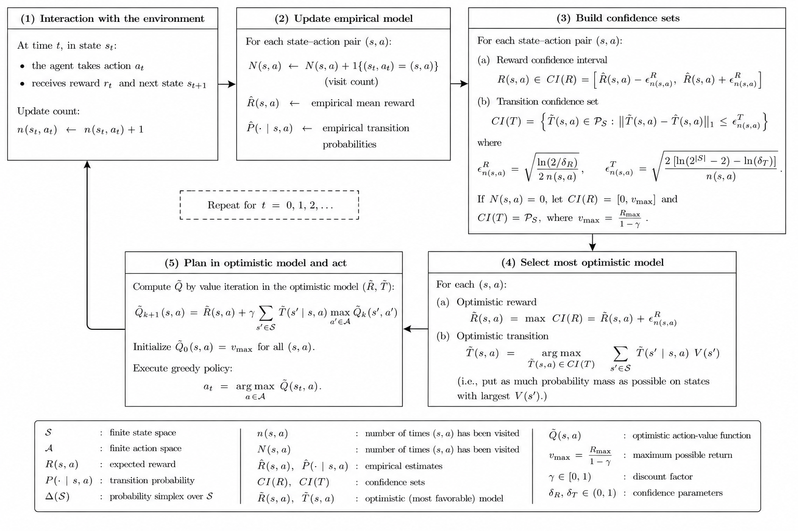

# Model-Based Interval Estimation for MDPs

### Reproduction & Extension Study
### Seminar — Advanced Topics in Reinforcement Learning and Decision Making

**Authors:**   
**Allizha Theiventhiram** — University of Neuchâtel — allizha.theiventhiram@unine.ch  
**Boris Verdecia Echarte** — University of Neuchâtel — boris.verdecia@unine.ch  
**Aurélie Wasem** — University of Neuchâtel — aurelie.wasem@unine.ch  
**Rithika Shyam Kumar** — University of Bern — rithika.shyamkumar@students.unibe.ch  


This repository contains the implementation and results of a seminar project conducted in **Advanced Topics in Reinforcement Learning and Decision Making** by Prof. Christos Dimitrakakis, within the [Swiss Joint Master in Computer Science](https://mcs.unibnf.ch/).

---

## Project Overview

This repository contains our reproduction and extension of the experiments from:

> Strehl, A. L., & Littman, M. L. (2008).  
> [An Analysis of Model-Based Interval Estimation for Markov Decision Processes](https://www.sciencedirect.com/science/article/pii/S0022000008000767?ref=pdf_download&fr=RR-2&rr=9dfde5654e296aa0).  
> Journal of Computer and System Sciences, 74(8), pages 1309–1331.

The paper introduces **MBIE** (Model-Based Interval Estimation) and proves the first fully explicit PAC-MDP sample-complexity bound for a confidence-interval-based reinforcement learning algorithm. We reproduce the main benchmark results and run five extensions probing parameter sensitivity, learning dynamics, and generalisation to new environments.

---

## The MBIE Algorithm



> *Diagram created with the assistance of ChatGPT (OpenAI, 2025).*

MBIE operates in a 5-step loop: interact with the environment, update empirical estimates, build confidence intervals on rewards and transitions, select the most optimistic model within those intervals, and plan via value iteration. The key idea is **optimism in the face of uncertainty** — unknown state-action pairs are initialised to the maximum possible return $v_{\max} = R_{\max}/(1-\gamma)$.

---

## Algorithms Implemented

| Algorithm | Type | Reference |
|-----------|------|-----------|
| **MBIE** | CI-based, model-based | Strehl & Littman (2008) |
| **MBIE-EB** | CI-based with exploration bonus | Strehl & Littman (2008) |
| **R-Max** | Threshold-based, model-based | Brafman & Tennenholtz (2002) |
| **E³** | Explicit explore/exploit | Kearns & Singh (2002) |

---

## Environments

**RiverSwim** — 6 states in a chain. The agent must swim upstream against a stochastic current to reach a large reward. Requires long sequences of exploration before any reward signal.

**SixArms** — 7 states: a hub connected to 6 rooms. Higher-probability arms yield lower rewards, so the agent must learn to commit to low-probability but high-reward arms.

**FrozenLake 8×8** (Extension 5) — 64 states, sparse reward, stochastic transitions. Standard OpenAI Gymnasium benchmark used to test generalisation.

---

## Repository Structure

```
├── Seminar_RL.ipynb          # Main notebook — all experiments
├── figures/                  # All generated plots
│   ├── figure1.png           # MBIE algorithm diagram
│   ├── figure2.png           # RiverSwim reproduction
│   ├── figure3.png           # SixArms reproduction
│   ├── figure4.png           # RiverSwim learning curves
│   ├── figure5.png           # SixArms learning curves
│   ├── figure6.png           # m sensitivity on RiverSwim
│   ├── figure7.png           # m sensitivity on SixArms
│   ├── figure8_a.png         # A/B heatmap RiverSwim
│   ├── figure8_b.png         # A/B heatmap SixArms
│   ├── figure9.png           # γ sensitivity on RiverSwim
│   ├── figure10.png          # γ sensitivity on SixArms
│   ├── figure11.png          # FrozenLake bar chart
│   └── figure12.png          # FrozenLake learning curves
├── RL_paper.pdf              # Report (ICML 2025 format)
└── README.md
```

---

## Results Summary

### Reproduction

| Algorithm | RiverSwim | SixArms |
|-----------|-----------|---------|
| MBIE | 3.17M ± 0.12M | 6.20M ± 0.86M |
| MBIE-EB | 3.08M ± 0.14M | 8.29M ± 4.89M |
| R-Max | 3.01M ± 0.13M | 2.54M ± 2.09M |
| E³ | 2.45M ± 1.22M | 2.15M ± 2.20M |

*10 trials, 5000 steps, γ=0.95*

CI-based methods (MBIE, MBIE-EB) collect **3× more reward** than threshold-based methods (R-Max, E³) on SixArms. The advantage comes from *partial exploitation* — CI widths shrink continuously with each visit, allowing exploitation to begin before a pair is fully "known".

### Extensions

| Extension | Key finding |
|-----------|-------------|
| Learning curves | MBIE/MBIE-EB transition to exploitation ~500 steps earlier than R-Max/E³ |
| Sensitivity to m | MBIE/MBIE-EB stable for m ≥ 16; R-Max/E³ collapse for m ≥ 32 on SixArms |
| Sensitivity to A, B | B≈0 optimal on RiverSwim; SixArms sensitive to B |
| Sensitivity to γ | All algorithms improve with γ on RiverSwim; complex on SixArms |
| FrozenLake 8×8 | MBIE (3.33) and MBIE-EB (2.87) vs R-Max (0.93) and E³ (0.40) |

---

## Bug Fix

One reproducibility issue was identified and fixed:

**E³ escape probability** — the rollout must follow $Q_{\text{explore}}$, not $Q_{\text{exploit}}$. The exploit policy assigns Q=0 to unknown pairs, causing $p_{\text{escape}}=0$ and the agent never exploring.

---

## Reproducibility Note

Strehl & Littman (2008) provide neither source code nor a complete experimental setup. Parameter values are reported only as the result of *"a broad search,"* without specifying details such as the search grid, number of trials, or random seed. All implementation details except for input parameters of the different algorithms were reconstructed independently. Parameters used:

| | RiverSwim | SixArms |
|--|-----------|---------|
| MBIE A, B | 0.3, 0.0 | 0.3, 0.08 |
| MBIE-EB C | 0.4 | 0.8 |
| R-Max m | 16 | 6 |
| E³ m, thresh | 16, 0.01 | 4, 0.09 |

---

## Setup

```bash
pip install numpy matplotlib tqdm gymnasium
jupyter notebook Seminar_RL.ipynb
```

Run all cells in order. The notebook is self-contained — environments, algorithms, experiments, and plots are all defined inline.

---

## Citation

```bibtex
@article{strehl2008mbie,
  author  = {Strehl, Alexander L. and Littman, Michael L.},
  title   = {An analysis of model-based interval estimation for {Markov} decision processes},
  journal = {Journal of Computer and System Sciences},
  volume  = {74},
  number  = {8},
  pages   = {1309--1331},
  year    = {2008}
}
```

---

## LLM Usage

Large language models (ChatGPT, Claude, Gemini) were used to assist with understanding theoretical concepts, debugging code, and writing. All mathematical content, experimental results, and scientific conclusions are our own.
